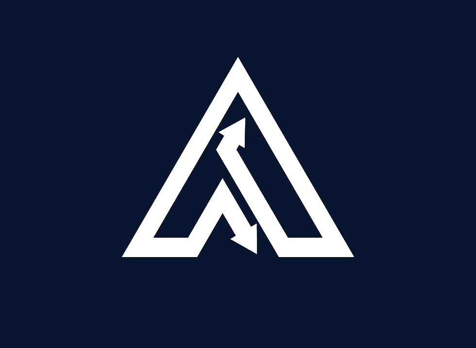
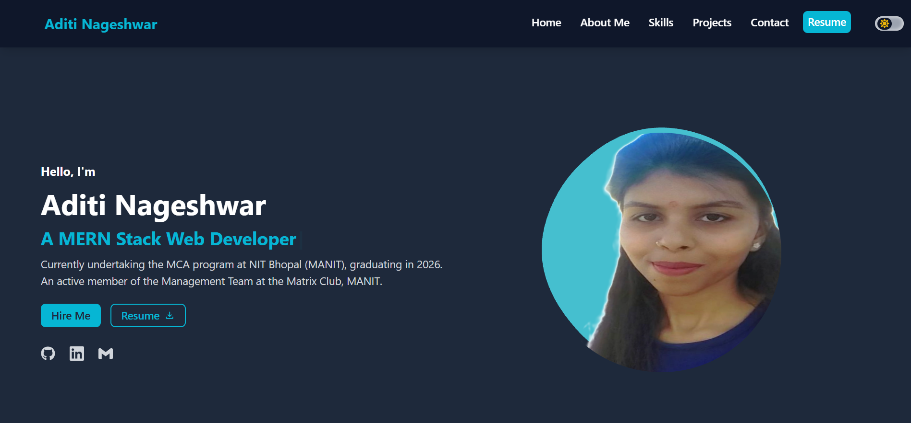

<h1>  Personal Portfolio </h1>

 

<h3>😊 Welcome to my personal portfolio! </h3> 

This website showcases some of the projects I've worked on, including detailed descriptions and links to code repositories, along with my resume and a list of technical skills and tools I am proficient in.

<h2>🚀Features</h2>

This portfolio supports a <strong>dark mode / light mode toggle</strong> that allows you to switch between themes for a personalized browsing experience.

<h3>🔗 Portfolio Link: <a href="https://aditinageshwar.netlify.app/ ">https://aditinageshwar.netlify.app/</a></h3>

<h2>📧 Contact</h2>

**Email** : aditinageshwar7@gmail.com